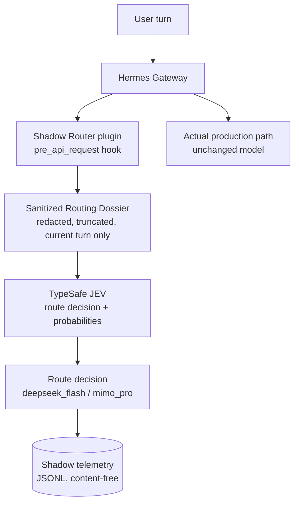
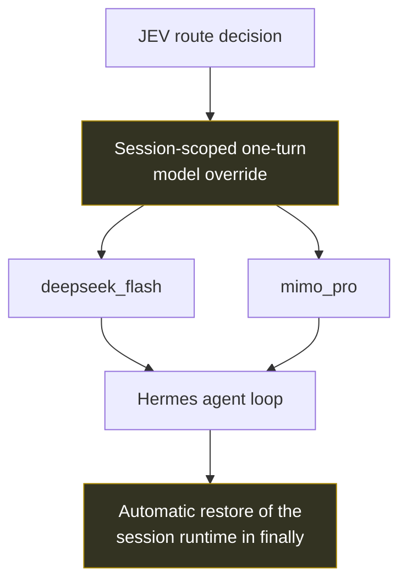

# hermes-adaptive-model-router

A privacy-preserving adaptive LLM routing layer for **Hermes Agent**, using a
TypeSafe JEV routing service to choose between a fast/cost-efficient model and a
high-capability model — while keeping fail-open behaviour, session safety, a
runtime kill switch and production observability.

> **Status: shadow-first.** Routing decisions are collected and logged, but the
> model that actually executes a turn is still chosen by the gateway's own
> configuration. Automatic provider switching is **designed, not enabled**.

Built for / tested with **Hermes Agent v0.21.5** (Nous Research). This repository is
an independent plugin/integration — it is not affiliated with Nous Research and
contains no part of the Hermes source tree.

---

## Problem

An agent that runs long tool-calling loops on a single model is always paying the
wrong price somewhere:

| Situation | Cost of a single-model agent |
|---|---|
| Trivial turn (status check, one command) | The most capable model is billed at premium latency and price |
| Genuinely hard turn (architecture, multi-file debug) | A cheap/fast model produces shallow work that has to be redone |
| Manual switching | Poor UX, and mid-loop switches can break context and prompt caching |
| Third-party router in the request path | New privacy surface (full prompts leave the host) and a new single point of failure |

## Solution

Route with a **decision service that receives only a sanitised fragment of the
current turn**, and act on the decision only after the routing layer has proven
itself on real traffic.



The decision is recorded; the production path is untouched. That is the whole point
of the shadow-first rollout: **observable before automatic**.

### Future auto routing (designed, not enabled)



Everything marked *future* is architecture work in `docs/auto-routing-design.md`.
It is not implemented in this release, and enabling it additionally requires an
explicit approval flag that the code checks itself.

## Design principles

1. **Lowest sufficient model.** Route by task requirements, not by habit.
2. **Privacy by design.** The routing service receives a redacted, truncated dossier
   derived from the current turn and nothing else: no memory, no conversation
   history, no tool output, no file contents, no credentials. Be precise about what
   that means — the sanitised turn text *is* transmitted, and redaction is
   deterministic pattern matching, **not** a confidentiality or DLP guarantee.
3. **Fail-open.** A routing layer that can break the agent is worse than no routing
   layer. Timeouts, HTTP errors and malformed responses are classified and dropped.
4. **No single point of failure.** The decision service is strictly advisory; the
   turn proceeds regardless of its answer.
5. **Session isolation.** Any future switch is scoped to one session and one turn.
6. **Observable before automatic.** Shadow mode first, statistics second, autonomy last.
7. **Reversible changes.** A sentinel file turns everything off without a restart.
8. **Minimal upstream modification.** One plugin hook; zero Hermes core patches.

## Current status

| Capability | Status |
|---|---|
| Production shadow collection | **Validated** on a live messaging gateway |
| DeepSeek V4.1 Flash integration | **Validated** (text, reasoning, tools, multi-step loop, coding, error paths) |
| MiMo V2.6 Pro integration | **Validated** (same matrix) |
| Privacy redaction + privacy fallback | **Validated** |
| Runtime kill switch | **Validated** (26/26 parser tests, fail-safe = off; no override flag) |
| Real/test telemetry separation | **Validated** |
| Route availability | **Configured, never assumed** — `JEV_AVAILABLE_ROUTES`; the public default is empty |
| CI (offline suites + secret scan) | **Configured** in `.github/workflows/ci.yml`; no secrets required |
| Automatic provider switching | **Design stage — not enabled** |
| Concurrency isolation for auto mode | **Analyzed; one empirical test still outstanding** |

No cost-saving, performance or scale claim is made here: the sample of real shadow
turns is intentionally small and is reported as distributions, not as headline
numbers.

## How it works

1. **Hook.** The plugin registers a single observer hook (`pre_api_request`) that the
   Hermes core already calls before each LLM request — and already wraps in
   fail-open error handling. The hook always returns `None`, so no context is
   injected and no request content is modified.
2. **First call of a turn.** Routing happens once per turn: retries and subsequent
   tool-loop iterations are explicitly skipped (`api_call_count`/`retry_count`).
3. **Dossier.** A minimal JSON object is built from the current user message:
   redacted and truncated text, boolean requirement flags (tool use, shell, coding,
   debugging, research, long context), risk flags (destructive action, production
   change) and the set of available routes.
4. **Redaction.** Deterministic, offline, regex-based: private key material, prefixed
   API keys, bearer tokens, `key=value` secrets, emails, IPv4/IPv6 addresses,
   `user@host` targets and long opaque tokens. If private key material is detected,
   the turn is **not** sent anywhere and a local privacy fallback is recorded.
5. **Decision.** `POST /v1/systemone` with a `choice` question and two criteria;
   the response carries a choice, a confidence and probabilities. Every failure is
   classified as `timeout`, `http_<code>`, `urlerror_*` or `malformed_*`.
6. **Telemetry.** A bounded queue plus a daemon worker keep the routing call off the
   request path; a full queue drops the sample instead of delaying the turn. Records
   contain outcome data and task features only.
7. **Mode.** Every turn re-resolves the runtime mode from a local state file
   (kill sentinel → state file → breaker → approval/lease/heartbeat). Fail-safe is
   `off`.

## Repository layout

```
router/     the routing library (config, redact, dossier, client, shadow, state)
plugin/     the Hermes Agent plugin (plugin.yaml + pre_api_request hook)
tests/      router 39 checks offline (46 with RUN_LIVE_TESTS=1) · kill-switch 26 ·
            scanner controls 24 (positive, negative, adversarial) · installer 36
            (stand-in hermes CLI; target vs decoy home; existing state preserved)
tools/      shadow_stats.py (real/test separation) · init_state.py (state file; no
            override for the kill sentinel) · install_plugin.sh (persistent install,
            backs up before writing) · secret_scan.py (tree + history; fails when a
            scan is incomplete)
docs/       architecture, shadow mode, privacy model, failover, validation, auto design
examples/   fully synthetic configuration and telemetry samples
.github/    CI: offline suites + state-init dry run + secret scan (no secrets configured)
```

## Quick start

```bash
git clone https://github.com/INEEDBUG/hermes-adaptive-model-router
cd hermes-adaptive-model-router

# 1. run the suites — offline by default: no credential, no network, no side effects
python3 tests/test_router.py
python3 tests/test_state.py

# 2. install persistently (idempotent: merges plugins.enabled, never replaces the list,
#    never resets an existing runtime state)
./tools/install_plugin.sh --hermes-home "$HERMES_HOME" --dry-run   # inspect first
./tools/install_plugin.sh --hermes-home "$HERMES_HOME"
#    then restart the gateway so the plugin is loaded and the environment is re-read
```

The installer copies the plugin into `$HERMES_HOME/plugins/`, **persists**
`JEV_ROUTER_ROOT` in the Hermes `.env` (append-only, never overwriting an existing
value), **merges** `jev-shadow-router` into the existing `plugins.enabled` list, and
creates the runtime state file **only when it does not exist yet**. Every file it
touches is backed up first — `config.yaml.bak.<timestamp>` immediately before the first
`hermes config set`, `.env.bak.<timestamp>` before the append — a file whose backup
cannot be made is left untouched, and the backups are listed at the end of the run.
Every CLI call is made with this `HERMES_HOME` set explicitly, so the file that gets
edited is the file that was backed up (never the CLI's own default home), and
`--dry-run` prints the actions, including the planned backups, without performing them.

Re-running it is idempotent: an existing `mode.json` — whatever it records, including a
tripped breaker flag — and a `KILL` sentinel are preserved byte-for-byte, so an installer
run can neither reset the mode nor lift a stop.

### Runtime authority: the state file, not `ROUTER_MODE`

The plugin resolves its mode **once per turn from the state file**
(`$JEV_STATE_DIR/mode.json`). A **missing, unreadable or corrupt state file resolves
to `off`** — fail-safe, deliberately. `ROUTER_MODE` is only a default used inside the
library's configuration helper; it is *not* the runtime switch, so setting
`ROUTER_MODE=shadow` on its own collects nothing.

Collection must be enabled explicitly, and the tool refuses to write while a `KILL`
sentinel is present — there is no override flag, so resuming means deleting the
sentinel deliberately first:

```bash
python3 tools/init_state.py             # writes mode=shadow atomically
python3 tools/init_state.py --dry-run   # prints the paths and the decision, writes nothing
python3 tools/init_state.py --mode off  # stop collecting, keep the installation
```

`auto` is never written by that tool: automatic switching is not implemented in this
release, and if a state file records it the plugin resolves it to `shadow` and appends
an `auto_not_implemented` entry to the mode audit log.

Configuration is environment-first, then `.env`, then built-in defaults
(see `examples/config.example.env`):

| Variable | Default | Meaning |
|---|---|---|
| `ROUTER_MODE` | `shadow` | default used by `router/config.py` only; **not** the runtime switch (see above) |
| `JEV_AUTO_APPROVED` | unset | explicit approval gate for `auto`; unset forces `shadow` |
| `JEV_MODEL` | `jev-latest` | routing model alias |
| `JEV_MIN_CONFIDENCE` | `0.65` | below this the simulated decision prefers the capable route |
| `JEV_MIN_MARGIN` | `0.15` | minimal top-2 probability margin |
| `JEV_TIMEOUT_SECONDS` | `3` | hard cap for the routing call |
| `JEV_AVAILABLE_ROUTES` | empty | routes this deployment has validated; empty means none, so no record claims an unvalidated provider is executable |
| `TYPESAFE_API_KEY` | — | credential for the routing service (never logged) |
| `JEV_STATE_DIR` | `$HERMES_HOME/jev_router/state` | kill sentinel + state file |
| `JEV_LOG_DIR` | `$HERMES_HOME/logs/router` | shadow telemetry |

## Observability

`tools/shadow_stats.py` reports `real_turns`, route counts and shares, confidence
(mean/median/p10/p90), probability margin distribution, JEV latency
(mean/p50/p95/max), timeout/error counts, privacy fallbacks, and task-category plus
**Routing Dossier size buckets** per route — the bucket is a routing-input-size proxy,
not the agent's conversation-context or prompt-cache size.

Real turns are separated from everything else: a record only counts as production
traffic when the session embedded in its `turn_id` exists in the Hermes session
database with a real messaging platform as its source. Manual tests, CLI one-shot
sessions and fault-injection runs are bucketed as excluded and listed explicitly, so
they can never inflate production statistics.

## Validation

```
router suite, offline default .... 39/39 checks pass
router suite, RUN_LIVE_TESTS=1 ... 46/46 checks pass (adds the live routing group)
kill-switch resolver ............. 26/26 checks pass
secret-scanner controls .......... 24/24 checks pass (positive, negative, adversarial)
installer ........................ 36/36 checks pass (stand-in CLI, target vs default
                                   home, existing state preserved)
production shadow ................ validated through a real messaging gateway
fail-open ........................ validated under injected failures and
                                   one observed real routing timeout
```

The live routing group is **opt-in** (`RUN_LIVE_TESTS=1`, plus a configured
credential): a credential merely being present on the machine never triggers a
third-party call, so the default run is fully offline and runnable by anyone. CI runs
all four suites, the state-initialiser dry run and the secret scan on every push with
no secrets configured. The scan is built to fail: findings exit 1, and an object left
unscanned (over the size cap) exits 3 instead of reporting clean. See
`docs/provider-validation.md` for the per-provider matrix.

## Privacy and security

See [`SECURITY.md`](SECURITY.md) and [`docs/privacy-model.md`](docs/privacy-model.md).
Summary: the decision service receives a redacted dossier, never raw private content;
telemetry is content-free; credentials are never logged; the kill switch makes a
third-party call impossible without a restart.

## Kill switch

```bash
touch "$HERMES_HOME/jev_router/state/KILL"   # effective on the next turn
```

Precedence: `KILL` sentinel → state file presence/validity → breaker flag →
approval + lease + heartbeat. Anything unreadable, corrupt or missing resolves to
`off`. See `docs/failover-and-kill-switch.md`.

## Limitations

- Redaction is pattern-based, not a formal data-loss-prevention guarantee.
- The provider-side prompt cache is invalidated by provider switching; per-turn
  switching is therefore treated as a cost, not a feature (see the auto design doc).
- Auto mode has **no** completed concurrency test yet; the isolation requirements it
  must satisfy first are documented, not assumed.
- The context-size signal that sticky routing needs is **not collected today**:
  `dossier_token_estimate` measures the routing input, not the agent's conversation
  context or the provider's prompt cache. A future auto release must collect that
  runtime signal before the switching rule can be evaluated.
- Route availability is **configured, not discovered**: with `JEV_AVAILABLE_ROUTES`
  empty (the public default) nothing is executable, so `would_execute` is recorded as
  `null` rather than naming a provider that was never validated.
- Statistics from a small real-traffic sample are reported as distributions only.

## License

MIT — see [`LICENSE`](LICENSE).
