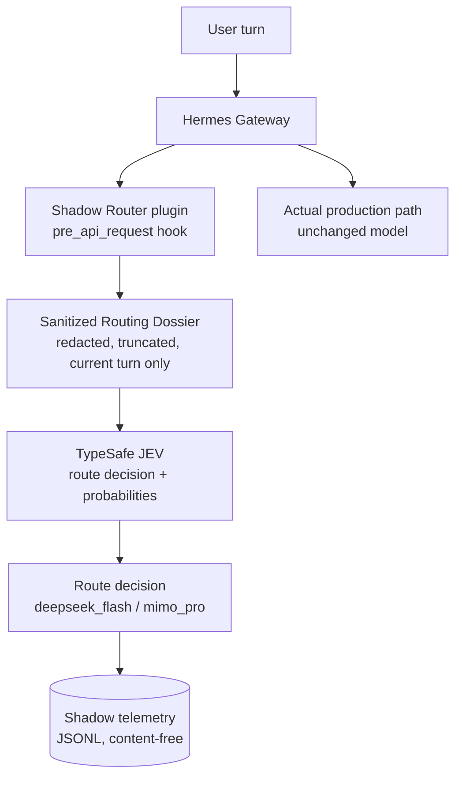
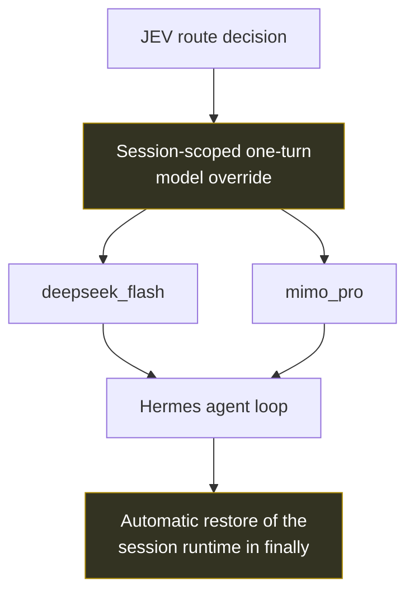

# hermes-adaptive-model-router

[English](README.md) | 简体中文

一个面向 **Hermes Agent** 的隐私保护型自适应 LLM 路由层：它借助 TypeSafe JEV
路由服务，在「快速/低成本模型」与「高能力模型」之间做出选择 —— 同时保持
fail-open 行为、会话安全、运行时 kill switch 与生产级可观测性。

> **状态：shadow 优先（shadow-first）。** 路由决策会被收集并记录，但实际执行某一轮
> 的模型仍由网关自身的配置决定。自动切换 provider 是**已设计、未启用**的能力；
> 观测范围也**仅限真人回合**。
>
> 路由器只观察真实人类回合：内部通知、subagent、后台任务与上下文续跑回合，全部在构建 Routing Dossier 之前被拒绝。
>
> The router only observes human-origin turns. Internal, subagent, background and continuation turns are rejected before Routing Dossier construction.

基于 / 测试于 **Hermes Agent v0.21.5**（Nous Research）。本仓库是一个独立的
plugin/integration —— 与 Nous Research 无隶属关系，也不包含 Hermes 源码树的任何部分。

---

## Problem

一个在单一模型上跑长工具调用循环的 Agent，总会在某个地方付出错误的代价：

| 情况 | 单模型 Agent 的代价 |
|---|---|
| 琐碎的轮次（查看状态、执行一条命令） | 能力最强的模型按高延迟、高价格计费 |
| 真正困难的轮次（架构设计、多文件调试） | 便宜/快速的模型给出浅层结果，必须返工重做 |
| 手动切换 | UX 糟糕，而且循环中途切换可能破坏上下文与 prompt cache |
| 在请求路径上引入第三方 router | 新增隐私暴露面（完整 prompt 离开本机），并新增一个单点故障 |

## Solution

用一个**只接收当前轮次经脱敏片段（a sanitised fragment of the current turn）**的
决策服务来做路由，并且只有在路由层已经在真实流量上证明自己之后，才对决策采取行动。



决策会被记录，生产路径保持不变。这正是 shadow-first 上线的全部意义：
**先可观测，后自动化**。

### Future auto routing（已设计，未启用）



所有标记为 *future* 的内容都是 `docs/auto-routing-design.md` 里的架构工作。
它在本版本中并未实现，而且启用它还需要一个代码自身会检查的显式批准标志。

## 设计原则

1. **最低充分模型（lowest sufficient model）。** 按任务需求路由，而不是按习惯路由。
2. **隐私内建设计（privacy by design）。** 路由服务收到的是由当前轮次派生、经脱敏并
   截断的 dossier，除此之外再无其他：没有 memory、没有对话历史、没有工具输出、没有
   文件内容、没有凭据。这里需要说得精确 —— 脱敏后的轮次文本**确实**会被传输，而脱敏
   是确定性的模式匹配，**并不是**保密性或 DLP 保证。
3. **Fail-open。** 一个可能弄坏 Agent 的路由层，比没有路由层更糟。超时、HTTP 错误与
   畸形响应都会被分类并丢弃。
4. **无单点故障。** 决策服务严格只具建议性；无论它给出什么答案，轮次都会照常继续。
5. **会话隔离（session isolation）。** 未来任何切换都限定在单个 session 与单个轮次内。
6. **先可观测，后自动化。** 先 shadow，再统计，最后才谈自主。
7. **可回滚的变更。** 一个 sentinel 文件即可关闭一切，无需重启。
8. **只观察真人回合。** 一次路由观测会把当前轮次脱敏后的文本发给第三方服务，因此只有真人
   发出的回合才允许触发。资格判定是结构性的——`platform` 在白名单内 **且**
   `turn_origin == "user"`——且发生在任何 dossier 构建之前；缺失或未知的 origin 直接拒绝，
   绝不默认放行。
9. **最小化上游改动。** Shadow 路由逻辑仍然是插件式的；但严格的真人回合来源判定需要一份最小的
   Hermes v0.21.5 `turn_origin` 集成补丁。（Shadow routing logic remains plugin-based, while
   strict human-turn provenance requires a minimal Hermes v0.21.5 `turn_origin` integration patch.）

## 当前状态

| 能力 | 状态 |
|---|---|
| 生产环境 shadow 采集 | 已在真实消息网关上**验证** |
| DeepSeek V4.1 Flash 集成 | **已验证**（文本、推理、工具、多步循环、编码、错误路径） |
| MiMo V2.6 Pro 集成 | **已验证**（同一套矩阵） |
| 隐私脱敏 + 隐私 fallback | **已验证** |
| 真人回合来源边界 | **已验证**——离线双门矩阵、并发隔离、脱敏后的生产 smoke（真人 → 1 次观测；subagent / 内部通知 / 后台 review / 缺失 origin → 0） |
| content-free 拒绝计数 | **已验证**——仅记录 `date`、`platform`、`turn_origin`、`reason`、`count` |
| 运行时 kill switch | **已验证**（26/26 parser 测试，fail-safe = off；无 override 标志） |
| 真实/测试遥测分离 | **已验证** |
| 路由可用性 | **配置，绝不假定** —— `JEV_AVAILABLE_ROUTES`；公开默认值为空 |
| CI（离线套件 + 密钥扫描） | 已在 `.github/workflows/ci.yml` **配置**；无需任何密钥 |
| 自动 provider 切换 | **设计阶段 —— 未启用** |
| auto 模式的并发隔离 | **已分析；仍有一项实证测试未完成** |

这里不做出任何成本节省、性能或规模方面的声明：真实 shadow 轮次的样本刻意保持很小，
并且以分布形式呈现，而不是以头条数字呈现。

## 工作原理

1. **Hook。** 该 plugin 只注册一个观察者 hook（`pre_api_request`），Hermes 核心本就
   会在每次 LLM 请求前调用它 —— 并且本就用 fail-open 的错误处理包裹它。该 hook 始终
   返回 `None`，因此不会注入任何上下文，也不会修改任何请求内容。
2. **一轮中的首次调用。** 路由每轮只发生一次：重试与后续的工具循环迭代会被显式跳过
   （`api_call_count`/`retry_count`）。
3. **Dossier。** 由当前用户消息构建一个最小 JSON 对象：脱敏并截断后的文本、布尔需求
   标志（工具使用、shell、编码、调试、研究、长上下文）、风险标志（破坏性操作、生产
   变更）以及可用路由集合。
4. **脱敏（Redaction）。** 确定性、离线、基于正则：私钥材料、带前缀的 API key、
   bearer token、`key=value` 形式的秘密、邮箱、IPv4/IPv6 地址、`user@host` 目标以及
   长的不透明 token。如果检测到私钥材料，该轮次**不会**被发送到任何地方，并会记录一次
   本地隐私 fallback。
5. **决策。** 以 `choice` 型问题与两个准则调用 `POST /v1/systemone`；响应携带一个
   choice、一个 confidence 与概率。每一种失败都会被归类为 `timeout`、`http_<code>`、
   `urlerror_*` 或 `malformed_*`。
6. **遥测。** 一个有界队列加一个 daemon worker 让路由调用脱离请求路径；队列满时丢弃
   该样本，而不是拖延轮次。记录只包含结果数据与任务特征。
7. **模式。** 每一轮都从本地状态文件重新解析运行时模式（kill sentinel → 状态文件 →
   breaker → approval/lease/heartbeat）。Fail-safe 值为 `off`。

## 仓库结构

```
router/     the routing library (config, redact, dossier, client, shadow, state,
            skip_telemetry: content-free 拒绝计数)
plugin/     the Hermes Agent plugin (plugin.yaml + pre_api_request hook + 真人回合双门判定)
tests/      router 39 checks offline (46 with RUN_LIVE_TESTS=1) · 真人回合边界 37
            (双门矩阵、fail-closed、按回合计数、并发隔离、遥测审计) · kill-switch 26 ·
            scanner controls 24 (positive, negative, adversarial) · installer 36
            (stand-in hermes CLI; target vs decoy home; existing state preserved)
tools/      shadow_stats.py (real/test separation) · init_state.py (state file; no
            override for the kill sentinel) · install_plugin.sh (persistent install,
            backs up before writing) · secret_scan.py (tree + history; fails when a
            scan is incomplete)
docs/       architecture, shadow mode, privacy model, failover, validation, auto design
examples/   fully synthetic configuration and telemetry samples
.github/    CI: offline suites + state-init dry run + secret scan (no secrets configured)
```

## 快速开始

```bash
git clone https://github.com/INEEDBUG/hermes-adaptive-model-router
cd hermes-adaptive-model-router

# 1. run the suites — offline by default: no credential, no network, no side effects
python3 tests/test_router.py
python3 tests/test_state.py
python3 tests/test_turn_boundary.py     # 真人回合来源双门


# 2. install persistently (idempotent: merges plugins.enabled, never replaces the list,
#    never resets an existing runtime state)
./tools/install_plugin.sh --hermes-home "$HERMES_HOME" --dry-run   # inspect first
./tools/install_plugin.sh --hermes-home "$HERMES_HOME"
#    then restart the gateway so the plugin is loaded and the environment is re-read
```

安装脚本会把 plugin 复制进 `$HERMES_HOME/plugins/`，把 `JEV_ROUTER_ROOT` **持久化**写入
Hermes 的 `.env`（追加写入，永不覆盖已有的值），把 `jev-shadow-router` **合并**进既有的
`plugins.enabled` 列表（而不是替换它），并且**只在运行时状态文件尚不存在时**创建它。它
触碰的每个文件都会先被备份 —— `config.yaml.bak.<timestamp>` 就在第一次 `hermes config set`
之前、`.env.bak.<timestamp>` 在追加写入之前 —— 无法为某个文件创建备份时，该文件会被原样
保留、不做修改，所有备份都会在运行结束时列出。每一次 CLI 调用都显式设置了这个
`HERMES_HOME`，因此被编辑的文件正是被备份的那个文件（永远不是 CLI 自己的默认 home），
`--dry-run` 也只打印将要执行的动作（包括计划中的备份），不实际执行。

重跑它是幂等的：既有的 `mode.json` —— 无论它记录了什么，包括已触发的 breaker 标志 ——
以及 `KILL` sentinel 都会被逐字节原样保留，因此一次安装脚本运行既不能重置模式，也不能
解除一次停止。

### 运行时权威：状态文件，而非 `ROUTER_MODE`

该 plugin **每一轮都从状态文件**（`$JEV_STATE_DIR/mode.json`）解析一次自己的模式。
**状态文件缺失、不可读或损坏时都会解析为 `off`** —— 这是刻意的 fail-safe 设计。
`ROUTER_MODE` 只是库内配置辅助函数使用的一个默认值；它*并不是*运行时开关，所以单独
设置 `ROUTER_MODE=shadow` 什么都采集不到。

采集必须被显式启用，而且只要 `KILL` sentinel 存在，该工具就会拒绝写入 —— 没有 override
标志，因此恢复意味着必须先有意删除该 sentinel：

```bash
python3 tools/init_state.py             # writes mode=shadow atomically
python3 tools/init_state.py --dry-run   # prints the paths and the decision, writes nothing
python3 tools/init_state.py --mode off  # stop collecting, keep the installation
```

该工具永不写入 `auto`：本版本并未实现自动切换；如果状态文件里记录了它，plugin 会把它
解析为 `shadow`，并向模式审计日志追加一条 `auto_not_implemented` 记录。

配置的读取优先级是：环境变量优先，其次是 `.env`，最后是内建默认值
（见 `examples/config.example.env`）：

| 变量 | 默认值 | 含义 |
|---|---|---|
| `ROUTER_MODE` | `shadow` | 仅由 `router/config.py` 使用的默认值；**不是**运行时开关（见上文） |
| `JEV_AUTO_APPROVED` | unset | 针对 `auto` 的显式批准闸门；未设置则强制为 `shadow` |
| `JEV_MODEL` | `jev-latest` | 路由模型别名 |
| `JEV_MIN_CONFIDENCE` | `0.65` | 低于该值时，模拟决策会偏向高能力路由 |
| `JEV_MIN_MARGIN` | `0.15` | top-2 概率的最小间隔 |
| `JEV_TIMEOUT_SECONDS` | `3` | 路由调用的硬性上限 |
| `JEV_AVAILABLE_ROUTES` | empty | 本部署已验证过的路由；为空表示没有任何路由，因此不会有记录声称某个未经验证的 provider 是可执行的 |
| `JEV_ALLOWED_PLATFORMS` | empty | 允许观测其**真人**回合的平台（如 `feishu`）；为空表示没有任何平台，路由保持静止，直到运维显式填写 |
| `JEV_INTERNAL_MARKERS` | empty | 可选的纵深防御异常检测标记（`'||'` 分隔）。它只能否决资格，永远不能授予资格，也永远不是边界本身 |
| `TYPESAFE_API_KEY` | — | 路由服务的凭据（永不写入日志） |
| `JEV_STATE_DIR` | `$HERMES_HOME/jev_router/state` | kill sentinel + 状态文件 |
| `JEV_LOG_DIR` | `$HERMES_HOME/logs/router` | shadow 遥测 |

## 可观测性

`tools/shadow_stats.py` 会报告 `real_turns`、各路由的计数与占比、置信度
（mean/median/p10/p90）、概率 margin 分布、JEV 延迟（mean/p50/p95/max）、超时/错误
计数、隐私 fallback，以及按路由划分的任务类别与 **Routing Dossier size buckets**
—— 该 bucket 只是路由输入规模的代理指标，并不是 Agent 的对话上下文规模，也不是
prompt-cache 规模。

真实轮次与其他一切被区分开：只有当记录 `turn_id` 中内嵌的 session 存在于 Hermes
session 数据库、且其来源是真实消息平台时，该记录才计为生产流量。手动测试、CLI 一次性
session 与故障注入运行都会被归入 excluded 桶并被显式列出，因此它们永远无法抬高生产
统计。

## 验证结果

真人回合来源边界：`python3 tests/test_turn_boundary.py` → **37/37 通过**（双门矩阵、fail-closed、
按回合计数、并发隔离、content-free 遥测审计、异常检测、记录携带来源标签）。
集成漂移检查：`python3 tools/check_turn_origin_patch.py --hermes-root <hermes>` → 退出码 0 表示完好，
退出码 3 表示漂移，此时路由器必须保持 fail-closed/off。


```
router suite, offline default .... 39/39 checks pass
router suite, RUN_LIVE_TESTS=1 ... 46/46 checks pass (adds the live routing group)
kill-switch resolver ............. 26/26 checks pass
secret-scanner controls .......... 24/24 checks pass (positive, negative, adversarial)
installer ........................ 36/36 checks pass (stand-in CLI, target vs default
                                   home, existing state preserved)
production shadow ................ validated through a real messaging gateway
fail-open ........................ validated under injected failures and
                                   one observed real routing timeout
```

在线路由组是**显式选择加入（opt-in）**的（`RUN_LIVE_TESTS=1`，外加已配置的凭据）：
仅仅机器上存在一份凭据永远不会触发第三方调用，因此默认运行完全离线、任何人都能跑。
CI 会在每次 push 时运行全部四个套件、状态初始化器的 dry run 以及密钥扫描，且不配置任何
密钥。该扫描的设计就是要失败：发现即退出码 1，若有对象未被扫描（超出大小上限）则退出码 3，
而不是报告为干净。各 provider 的详细矩阵见 `docs/provider-validation.md`。

## 隐私与安全

见 [`SECURITY.md`](SECURITY.md) 与 [`docs/privacy-model.md`](docs/privacy-model.md)。
概要：决策服务收到的是脱敏后的 dossier，从来不是原始私密内容；遥测不含内容；凭据永不
写入日志；kill switch 可以让一次第三方调用变得不可能，且无需重启。

## Kill Switch

```bash
touch "$HERMES_HOME/jev_router/state/KILL"   # effective on the next turn
```

优先级：`KILL` sentinel → 状态文件是否存在/是否有效 → breaker 标志 →
approval + lease + heartbeat。任何不可读、损坏或缺失的内容都会解析为 `off`。
见 `docs/failover-and-kill-switch.md`。

## 局限

- 脱敏是基于模式的，并不是正式的数据防泄漏（data-loss-prevention）保证。
- provider 侧的 prompt cache 会因 provider 切换而失效；因此按轮切换被视为一种成本，
  而不是一项特性（见 auto 设计文档）。
- auto 模式目前**没有**完成的并发测试；它必须先满足的隔离要求已被记录在案，
  而不是被假定成立。
- sticky routing 所需的上下文规模信号**今天并未被采集**：`dossier_token_estimate`
  度量的是路由输入，而不是 Agent 的对话上下文，也不是 provider 的 prompt cache。
  未来的 auto 版本必须先采集该运行时信号，才能评估切换规则。
- 路由可用性是**配置而来，不是被发现的**：当 `JEV_AVAILABLE_ROUTES` 为空（公开默认值）
  时没有任何路由可执行，因此 `would_execute` 会被记录为 `null`，而不是写出一个从未被
  验证过的 provider 名字。
- 来自小规模真实流量样本的统计只以分布形式报告。

## License

MIT —— 见 [`LICENSE`](LICENSE)。
