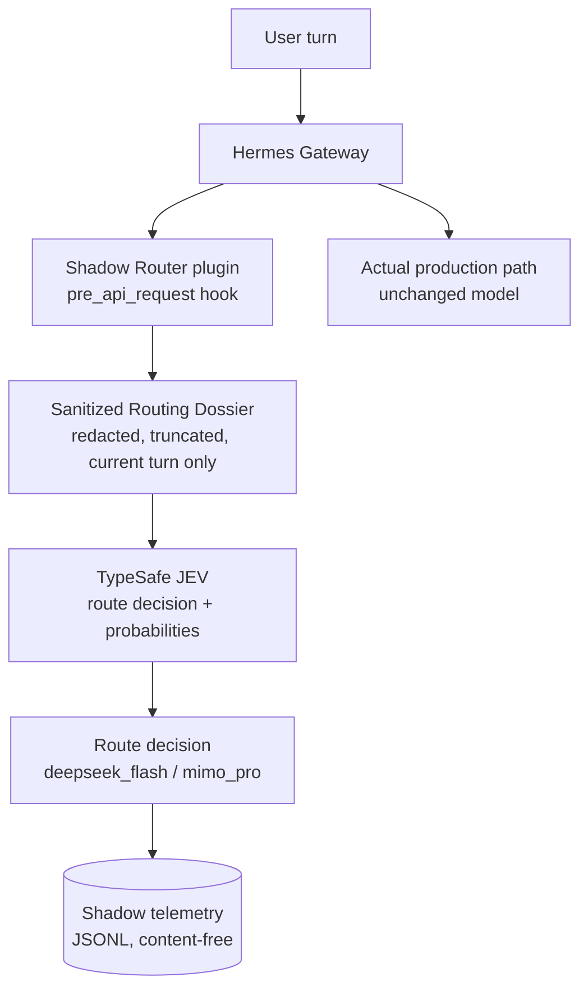
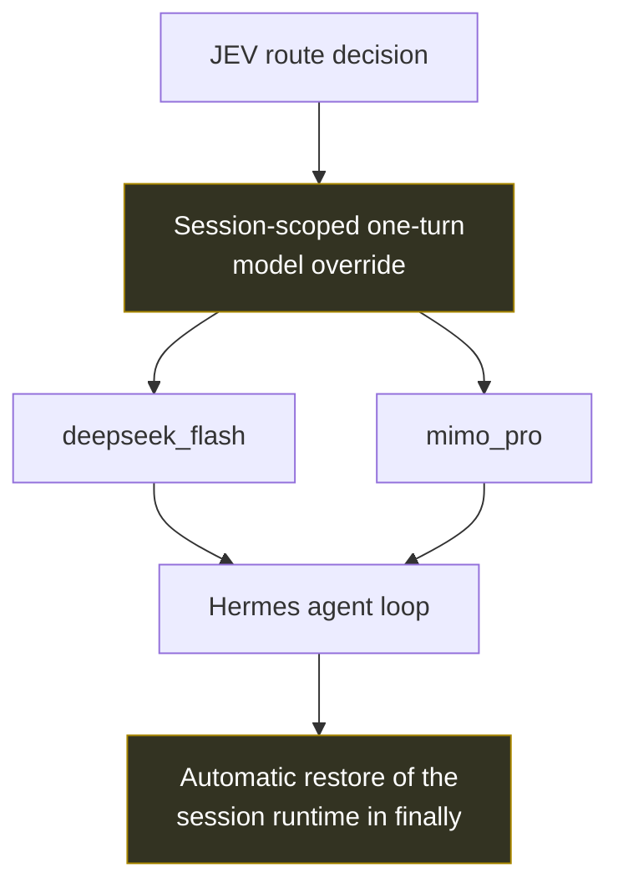

# hermes-adaptive-model-router

[English](README.md) | 简体中文

一个面向 **Hermes Agent** 的隐私保护型自适应 LLM 路由层：它借助 TypeSafe JEV
路由服务，在「快速/低成本模型」与「高能力模型」之间做出选择 —— 同时保持
fail-open 行为、会话安全、运行时 kill switch 与生产级可观测性。

> **状态：shadow 优先（shadow-first）。** 路由决策会被收集并记录，但实际执行某一轮
> 的模型仍由网关自身的配置决定。自动切换 provider 是**已设计、未启用**的能力。

基于 / 测试于 **Hermes Agent v0.21.5**（Nous Research）。本仓库是一个独立的
plugin/integration —— 与 Nous Research 无隶属关系，也不包含 Hermes 源码树的任何部分。

---

## Problem

一个在单一模型上跑长工具调用循环的 Agent，总会在某个地方付出错误的代价：

| 情况 | 单模型 Agent 的代价 |
|---|---|
| 琐碎的轮次（查看状态、执行一条命令） | 能力最强的模型按高延迟、高价格计费 |
| 真正困难的轮次（架构设计、多文件调试） | 便宜/快速的模型给出浅层结果，必须返工重做 |
| 手动切换 | UX 糟糕，而且循环中途切换可能破坏上下文与 prompt cache |
| 在请求路径上引入第三方 router | 新增隐私暴露面（完整 prompt 离开本机），并新增一个单点故障 |

## Solution

用一个**几乎看不到任何内容**的决策服务来做路由，并且只有在路由层已经在真实流量上
证明自己之后，才对决策采取行动。



决策会被记录，生产路径保持不变。这正是 shadow-first 上线的全部意义：
**先可观测，后自动化**。

### Future auto routing（已设计，未启用）



所有标记为 *future* 的内容都是 `docs/auto-routing-design.md` 里的架构工作。
它在本版本中并未实现，而且启用它还需要一个代码自身会检查的显式批准标志。

## 设计原则

1. **最低充分模型（lowest sufficient model）。** 按任务需求路由，而不是按习惯路由。
2. **隐私内建设计（privacy by design）。** 路由服务收到的是由当前轮次派生、经脱敏并
   截断的 dossier —— 绝不是 memory、history、工具输出或凭据。
3. **Fail-open。** 一个可能弄坏 Agent 的路由层，比没有路由层更糟。超时、HTTP 错误与
   畸形响应都会被分类并丢弃。
4. **无单点故障。** 决策服务严格只具建议性；无论它给出什么答案，轮次都会照常继续。
5. **会话隔离（session isolation）。** 未来任何切换都限定在单个 session 与单个轮次内。
6. **先可观测，后自动化。** 先 shadow，再统计，最后才谈自主。
7. **可回滚的变更。** 一个 sentinel 文件即可关闭一切，无需重启。
8. **最小化上游改动。** 一个 plugin hook；零 Hermes 核心补丁。

## 当前状态

| 能力 | 状态 |
|---|---|
| 生产环境 shadow 采集 | 已在真实消息网关上**验证** |
| DeepSeek V4.1 Flash 集成 | **已验证**（文本、推理、工具、多步循环、编码、错误路径） |
| MiMo V2.6 Pro 集成 | **已验证**（同一套矩阵） |
| 隐私脱敏 + 隐私 fallback | **已验证** |
| 运行时 kill switch | **已验证**（21/21 parser 测试，fail-safe = off） |
| 真实/测试遥测分离 | **已验证** |
| 自动 provider 切换 | **设计阶段 —— 未启用** |
| auto 模式的并发隔离 | **已分析；仍有一项实证测试未完成** |

这里不做出任何成本节省、性能或规模方面的声明：真实 shadow 轮次的样本刻意保持很小，
并且以分布形式呈现，而不是以头条数字呈现。

## 工作原理

1. **Hook。** 该 plugin 只注册一个观察者 hook（`pre_api_request`），Hermes 核心本就
   会在每次 LLM 请求前调用它 —— 并且本就用 fail-open 的错误处理包裹它。该 hook 始终
   返回 `None`，因此不会注入任何上下文，也不会修改任何请求内容。
2. **一轮中的首次调用。** 路由每轮只发生一次：重试与后续的工具循环迭代会被显式跳过
   （`api_call_count`/`retry_count`）。
3. **Dossier。** 由当前用户消息构建一个最小 JSON 对象：脱敏并截断后的文本、布尔需求
   标志（工具使用、shell、编码、调试、研究、长上下文）、风险标志（破坏性操作、生产
   变更）以及可用路由集合。
4. **脱敏（Redaction）。** 确定性、离线、基于正则：私钥材料、带前缀的 API key、
   bearer token、`key=value` 形式的秘密、邮箱、IPv4/IPv6 地址、`user@host` 目标以及
   长的不透明 token。如果检测到私钥材料，该轮次**不会**被发送到任何地方，并会记录一次
   本地隐私 fallback。
5. **决策。** 以 `choice` 型问题与两个准则调用 `POST /v1/systemone`；响应携带一个
   choice、一个 confidence 与概率。每一种失败都会被归类为 `timeout`、`http_<code>`、
   `urlerror_*` 或 `malformed_*`。
6. **遥测。** 一个有界队列加一个 daemon worker 让路由调用脱离请求路径；队列满时丢弃
   该样本，而不是拖延轮次。记录只包含结果数据与任务特征。
7. **模式。** 每一轮都从本地状态文件重新解析运行时模式（kill sentinel → 状态文件 →
   breaker → approval/lease/heartbeat）。Fail-safe 值为 `off`。

## 仓库结构

```
router/     the routing library (config, redact, dossier, client, shadow, state)
plugin/     the Hermes Agent plugin (plugin.yaml + pre_api_request hook)
tests/      offline test suites (33 routing checks, 21 kill-switch checks)
tools/      production statistics with real/test sample separation
docs/       architecture, shadow mode, privacy model, failover, validation, auto design
examples/   fully synthetic configuration and telemetry samples
```

| 目录 | 内容 |
|---|---|
| `router/` | 路由库（config、redact、dossier、client、shadow、state） |
| `plugin/` | Hermes Agent plugin（`plugin.yaml` + `pre_api_request` hook） |
| `tests/` | 离线测试套件（33 项 routing 检查、21 项 kill-switch 检查） |
| `tools/` | 生产统计，含真实/测试样本分离 |
| `docs/` | 架构、shadow 模式、隐私模型、failover、验证、auto 设计 |
| `examples/` | 完全合成的配置与遥测样例 |

## 快速开始

```bash
git clone https://github.com/INEEDBUG/hermes-adaptive-model-router
cd hermes-adaptive-model-router

# 1. try it without touching a running agent
JEV_LOG_DIR=/tmp/jev-shadow-logs python3 tests/test_router.py
python3 tests/test_state.py

# 2. install as a Hermes plugin
cp -r plugin "$HERMES_HOME/plugins/jev-shadow-router"
export JEV_ROUTER_ROOT="$PWD"          # lets the plugin import the router package
#   then enable it for the gateway (Hermes config):
#   hermes config set plugins.enabled '["jev-shadow-router"]'
```

配置的读取优先级是：环境变量优先，其次是 `.env`，最后是内建默认值
（见 `examples/config.example.env`）：

| 变量 | 默认值 | 含义 |
|---|---|---|
| `ROUTER_MODE` | `shadow` | `off` / `shadow`（auto 需要显式批准） |
| `JEV_AUTO_APPROVED` | unset | 针对 `auto` 的显式批准闸门；未设置则强制为 `shadow` |
| `JEV_MODEL` | `jev-latest` | 路由模型别名 |
| `JEV_MIN_CONFIDENCE` | `0.65` | 低于该值时，模拟决策会偏向高能力路由 |
| `JEV_MIN_MARGIN` | `0.15` | top-2 概率的最小间隔 |
| `JEV_TIMEOUT_SECONDS` | `3` | 路由调用的硬性上限 |
| `TYPESAFE_API_KEY` | — | 路由服务的凭据（永不写入日志） |
| `JEV_STATE_DIR` | `$HERMES_HOME/jev_router/state` | kill sentinel + 状态文件 |
| `JEV_LOG_DIR` | `$HERMES_HOME/logs/router` | shadow 遥测 |

## 可观测性

`tools/shadow_stats.py` 会报告 `real_turns`、各路由的计数与占比、置信度
（mean/median/p10/p90）、概率 margin 分布、JEV 延迟（mean/p50/p95/max）、超时/错误
计数、隐私 fallback，以及按路由划分的任务类别 / 上下文规模分布。

真实轮次与其他一切被区分开：只有当记录 `turn_id` 中内嵌的 session 存在于 Hermes
session 数据库、且其来源是真实消息平台时，该记录才计为生产流量。手动测试、CLI 一次性
session 与故障注入运行都会被归入 excluded 桶并被显式列出，因此它们永远无法抬高生产
统计。

## 验证结果

```
router offline + live groups ..... 33/33 checks pass
kill-switch resolver ............. 21/21 checks pass
production shadow ................ validated through a real messaging gateway
fail-open ........................ validated under injected failures and
                                   one observed real routing timeout
```

在线路由组会发起一次真实的决策调用，因此当没有配置凭据时，该组中的 7 项检查会被自动
跳过 —— 这样任何人都可以运行这套测试。各 provider 的详细矩阵见
`docs/provider-validation.md`。

## 隐私与安全

见 [`SECURITY.md`](SECURITY.md) 与 [`docs/privacy-model.md`](docs/privacy-model.md)。
概要：决策服务收到的是脱敏后的 dossier，从来不是原始私密内容；遥测不含内容；凭据永不
写入日志；kill switch 可以让一次第三方调用变得不可能，且无需重启。

## Kill Switch

```bash
touch "$HERMES_HOME/jev_router/state/KILL"   # effective on the next turn
```

优先级：`KILL` sentinel → 状态文件是否存在/是否有效 → breaker 标志 →
approval + lease + heartbeat。任何不可读、损坏或缺失的内容都会解析为 `off`。
见 `docs/failover-and-kill-switch.md`。

## 局限

- 脱敏是基于模式的，并不是正式的数据防泄漏（data-loss-prevention）保证。
- provider 侧的 prompt cache 会因 provider 切换而失效；因此按轮切换被视为一种成本，
  而不是一项特性（见 auto 设计文档）。
- auto 模式目前**没有**完成的并发测试；它必须先满足的隔离要求已被记录在案，
  而不是被假定成立。
- 来自小规模真实流量样本的统计只以分布形式报告。

## License

MIT —— 见 [`LICENSE`](LICENSE)。
