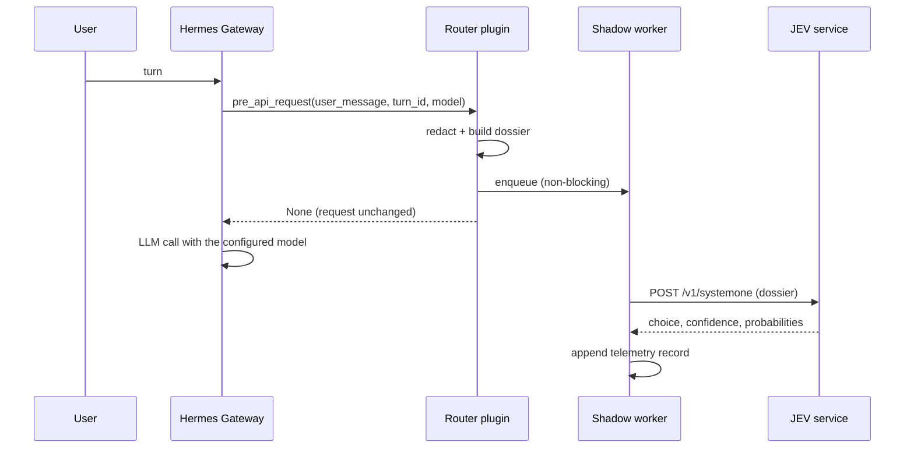

# Architecture

## Components

| Component | Responsibility | Does not do |
|---|---|---|
| Plugin (`plugin/`) | Register one observer hook, deduplicate per-turn calls, resolve mode | Modify requests, choose models |
| Dossier builder (`router/dossier.py`) | Turn → minimal structured features | Read history, memory or tool output |
| Redaction (`router/redact.py`) | Deterministic local sanitisation + unsafe detection | Call any external service |
| Client (`router/client.py`) | One routing request, full error classification | Retry, block, raise |
| Shadow worker (`router/shadow.py`) | Bounded queue, daemon worker, telemetry, simulation | Delay the request path |
| State (`router/state.py`) | Per-turn runtime mode resolution (fail-safe off) | Touch provider/model selection |

## Insertion point

The integration uses an existing Hermes extension point rather than a core patch:

- **Hook**: `pre_api_request`, dispatched by the agent runtime immediately before an
  LLM call. Its payload already carries the current turn's user message, a turn
  identifier, the model/provider about to be used and the API-call counter of the
  turn.
- **Why here**: the call site already wraps hook dispatch in error handling, so a
  faulty hook cannot break a turn; and because the hook receives the model that is
  about to execute, shadow records can state the real executing model next to the
  routing suggestion.
- **Cost**: register one hook. No fork, no patch, no parallel runtime.

Anything the hook returns is request content. This plugin always returns `None`,
which is what makes the shadow guarantee checkable by reading one line of code
(`plugin/__init__.py`, `_on_pre_api_request`).

## Data flow (shadow)

The user-visible path is `U → G → LLM`. The routing path is a side channel.

## Failure containment

| Failure | Handling |
|---|---|
| Routing service unreachable | Classified `timeout`/`urlerror_*`, turn unaffected |
| HTTP 401/429/5xx | Classified `http_<code>`, turn unaffected |
| Malformed or partial answer | Classified `malformed_*`, record rejected |
| Worker exception | Swallowed inside the worker thread |
| Queue saturation | Sample dropped (bounded queue, size 8) |
| Plugin exception | Swallowed; hook returns `None` |
| State resolution error | Resolves to `off` |

## Concurrency model (as analysed for future auto mode)

Findings from reading the gateway implementation, not assumptions:

- The gateway caches **one agent instance per session** (LRU-capped, idle-evicted), so
  an agent object is session-local rather than shared across sessions.
- A second message for the same routing key cannot slip past an in-flight turn: the
  in-flight marker is registered before any `await`.
- Two routing keys that resolve to the same session are still serialised by a
  per-session turn lease, so a session's turns do not overlap.
- Different sessions can run concurrently in different worker threads, each with its
  own agent instance.
- The runtime switched by a model change is an attribute of the agent instance
  (with an official restore primitive), not a global; provider clients are rebuilt
  per agent, and retries/fallback live above the client layer.

Consequence: a turn-scoped switch would be safe *by construction* provided it is
issued only for the session's own agent and always restored. This has **not** been
empirically tested under concurrent traffic, so auto mode remains disabled and the
required isolation is specified in `docs/auto-routing-design.md` rather than claimed.

## Why no proxy or parallel stack

A LiteLLM-style proxy in front of the gateway would (a) put every raw prompt of every
platform into a second component, (b) add a mandatory hop and a new single point of
failure, and (c) duplicate routing/credential logic that Hermes already owns. The
observer-hook design keeps the decision advisory, local and cheap to remove.
