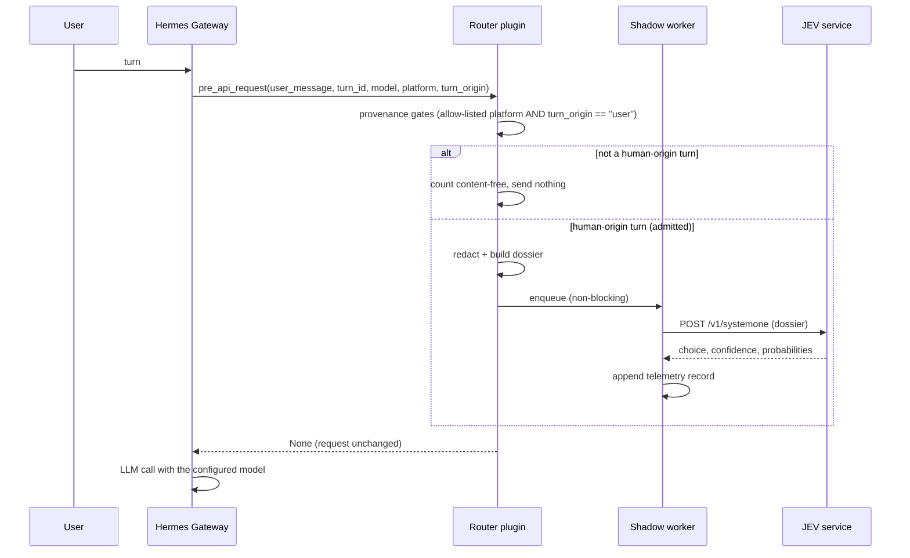

# Architecture

## Components

| Component | Responsibility | Does not do |
|---|---|---|
| Plugin (`plugin/`) | Register one observer hook, resolve mode, deduplicate per-turn calls, apply the human-turn provenance gates | Modify requests, choose models |
| Rejection counters (`router/skip_telemetry.py`) | Content-free per-turn counters for turns the boundary rejected | Store any content |
| Dossier builder (`router/dossier.py`) | Turn → minimal structured features | Read history, memory or tool output |
| Redaction (`router/redact.py`) | Deterministic local sanitisation + unsafe detection | Call any external service |
| Client (`router/client.py`) | One routing request, full error classification | Retry, block, raise |
| Shadow worker (`router/shadow.py`) | Bounded queue, daemon worker, telemetry, simulation | Delay the request path |
| State (`router/state.py`) | Per-turn runtime mode resolution (fail-safe off) | Touch provider/model selection |

## Insertion point

The plugin uses an existing Hermes extension point, and v0.2.0 adds one minimal upstream
integration next to it:

- **Core integration patch**: `patches/hermes-v0.21.5-turn-origin.patch` (built and tested
  against Hermes Agent v0.21.5) supplies the structural `turn_origin` label the provenance
  boundary needs. Shadow routing logic remains plugin-based, while strict human-turn
  provenance requires a minimal Hermes v0.21.5 turn_origin integration patch. Without it,
  every turn lacks a usable origin and every turn is rejected — inert, not unguarded.
- **Hook**: `pre_api_request`, dispatched by the agent runtime immediately before an
  LLM call. Its payload already carries the current turn's user message, a turn
  identifier, the model/provider about to be used and the API-call counter of the
  turn.
- **Why here**: the call site already wraps hook dispatch in error handling, so a
  faulty hook cannot break a turn; and because the hook receives the model that is
  about to execute, shadow records can state the real executing model next to the
  routing suggestion.
- **Cost**: register one hook, plus the minimal core integration patch above. No fork, no
  proxy, no parallel runtime.

Anything the hook returns is request content. This plugin always returns `None`,
which is what makes the shadow guarantee checkable by reading one line of code
(`plugin/__init__.py`, `_on_pre_api_request`).

### Runtime mode authority and durable installation

The mode is resolved **once per turn from the state file** (`mode.json`); the
`ROUTER_MODE` variable is only a default inside the library's config helper and does
not enable collection by itself. A missing, unreadable or corrupt state file resolves
to `off`. `tools/init_state.py` writes that file explicitly and atomically, refuses to
write while a `KILL` sentinel exists, and never writes `auto`.

Because a gateway restart runs a fresh process, the plugin's import path must survive
it: `tools/install_plugin.sh` copies the plugin into `$HERMES_HOME/plugins/`, persists
`JEV_ROUTER_ROOT` in the Hermes `.env` (append-only, never overwriting an existing
value), **merges** `jev-shadow-router` into the existing `plugins.enabled` list instead
of replacing it, and initialises the state file. Every touched file is backed up.

Automatic switching is not implemented in this release: a state file recording `auto`
is resolved to `shadow` and audited as `auto_not_implemented`.

### Human-turn provenance boundary (v0.2.0)

> The router only observes human-origin turns. Internal, subagent, background and
> continuation turns are rejected before Routing Dossier construction.

A routing observation is a privacy event: it hands a sanitised, truncated copy of the
current turn to a third-party decision service. Only a human-origin turn may cause one, so
the boundary is placed in the hook path **before anything is built**:

```
pre_api_request
  → resolve mode from the state file        (anything unexpected → off)
  → first API call of this turn?            (retries and tool-loop iterations dropped)
  → gate 1: platform      ∈ JEV_ALLOWED_PLATFORMS
  → gate 2: turn_origin   == "user"         (authoritative)
  → redact → dossier.build → shadow.submit  → routing service
```

Both gates live in one function (`plugin/__init__.py`, `_admit`) that runs before
`dossier.build` is ever called. Failing either gate returns immediately: the
`redact → dossier.build → shadow.submit` chain is never entered, no dossier exists, nothing
is enqueued and the routing service is never reached. The only trace a rejected turn leaves
is a content-free counter (`router/skip_telemetry.py`), written once per turn rather than
once per API call.

**Gate 1 alone is not a privacy boundary.** An internal notification, a background-review
fork, a compaction continuation or a subagent turn can carry the same platform label as a
human message, because a fork inherits `platform` from the session that spawned it — a
background review of a Feishu conversation reports `platform=feishu`. Verified in
production: internal-notification and background-review turns both arrived with
`platform=feishu` and were stopped only by gate 2.

`turn_origin` is supplied structurally by the Hermes core (see the patch above), decided
before the request is assembled, and never inferred from message text. Vocabulary: `user`,
`internal_notification`, `compaction_continuation`, `background_review`, `subagent`,
`oneshot`, `cron`, `curator`, `api_server`, `unknown`. A missing, empty or unrecognised
origin is rejected — never defaulted to `user` (fail-closed).

Validation: `tools/check_turn_origin_patch.py` checks the version target, every patch
marker, the plugin's two gates and an offline behavioural proof (missing/unknown/non-`user`
origin → zero calls to the routing service; allow-listed human turn → exactly one). Exit 3
means drift: keep the router fail-closed/off until the patch is re-applied. Offline,
`tests/test_turn_boundary.py` (37 checks, groups A–G) covers the gate matrix, the
fail-closed paths, per-turn counting, concurrency isolation, content-free telemetry and
provenance in the record. See `docs/privacy-model.md` for the privacy statement and
`docs/shadow-mode.md` for what the record and the counters contain.

Built and tested against Hermes Agent v0.21.5. Hermes Agent is a Nous Research project;
this repository is an independent plugin project with no affiliation to it.

## Data flow (shadow)



The user-visible path is `U → G → LLM`. The routing path is a side channel; the rejection
path is a local counter and nothing else.

## Failure containment

| Failure | Handling |
|---|---|
| Routing service unreachable | Classified `timeout`/`urlerror_*`, turn unaffected |
| HTTP 401/429/5xx | Classified `http_<code>`, turn unaffected |
| Malformed or partial answer | Classified `malformed_*`, record rejected |
| Worker exception | Swallowed inside the worker thread |
| Queue saturation | Sample dropped (bounded queue, size 8) |
| Plugin exception | Swallowed; hook returns `None` |
| State resolution error | Resolves to `off` |
| Turn is not provably human (origin missing, empty, unknown or ≠ `user`) | Rejected before dossier construction; content-free counter; routing service never called |
| `JEV_ALLOWED_PLATFORMS` empty (the public default) | Nothing is observed until an operator names a platform |
| Core integration patch absent or drifted | Every turn lacks a usable origin → zero routing calls; `tools/check_turn_origin_patch.py` exits 3 |

## Concurrency model (as analysed for future auto mode)

Findings from reading the gateway implementation, not assumptions:

- The gateway caches **one agent instance per session** (LRU-capped, idle-evicted), so
  an agent object is session-local rather than shared across sessions.
- A second message for the same routing key cannot slip past an in-flight turn: the
  in-flight marker is registered before any `await`.
- Two routing keys that resolve to the same session are still serialised by a
  per-session turn lease, so a session's turns do not overlap.
- Different sessions can run concurrently in different worker threads, each with its
  own agent instance.
- The runtime switched by a model change is an attribute of the agent instance
  (with an official restore primitive), not a global; provider clients are rebuilt
  per agent, and retries/fallback live above the client layer.

Consequence: a turn-scoped switch would be safe *by construction* provided it is
issued only for the session's own agent and always restored. This has **not** been
empirically tested under concurrent traffic, so auto mode remains disabled and the
required isolation is specified in `docs/auto-routing-design.md` rather than claimed.

The provenance boundary does not wait for that work: it is decided per turn and holds no
shared state beyond the per-turn de-duplication set, and group D of
`tests/test_turn_boundary.py` exercises a human turn and a background turn running
concurrently — one routing observation for the human turn, zero for the background turn.

## Why no proxy or parallel stack

A LiteLLM-style proxy in front of the gateway would (a) put every raw prompt of every
platform into a second component, (b) add a mandatory hop and a new single point of
failure, and (c) duplicate routing/credential logic that Hermes already owns. The
observer-hook design keeps the decision advisory, local and cheap to remove.
