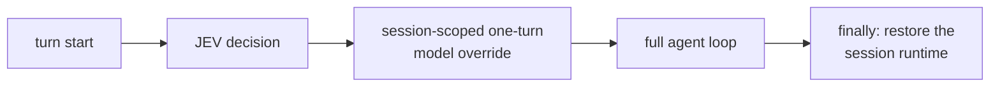

# Auto routing design (not enabled)

This document specifies how automatic switching *would* work. Nothing here is
implemented in this release, and enabling it requires an explicit approval flag that
the code itself checks.

## Eligibility precondition: human-turn provenance

Any future automatic behaviour inherits the eligibility gates the shadow observer already
applies, evaluated before a Routing Dossier is built:

| Gate | Condition | Authority |
|---|---|---|
| 1 | `platform` in `JEV_ALLOWED_PLATFORMS` | operator policy: which platforms may be observed |
| 2 | `turn_origin == "user"` | authoritative — this is the privacy boundary |

The router only observes human-origin turns. Internal, subagent, background and continuation turns are rejected before Routing Dossier construction.

Gate 1 alone is not a boundary: an auxiliary call, a subagent run or a background job can
inherit the platform label of the session that spawned it (a fork inherits `platform` from
the session that created it). Such a turn can therefore **never** be routed automatically,
and gate 2 is not a heuristic the auto release may relax — it is a precondition for a
decision being taken at all. `turn_origin` is a structural label supplied by the gateway
(`patches/hermes-v0.21.5-turn-origin.patch`); it is never inferred from message text, and
the label is evaluated before routing, not interpreted.

A turn whose provenance can no longer be established stays **fail-closed**: a missing,
empty or unrecognised `turn_origin` is rejected, never defaulted to `user`. The concrete
consequence of a bad integration is therefore *no routing*, not routing everything — if the
label disappears, the safe states are `off` and "rejected", and a missing label must never
be "fixed" by assuming a human.

Shadow routing logic remains plugin-based, while strict human-turn provenance requires a minimal Hermes v0.21.5 turn_origin integration patch.

Built and tested against Hermes Agent v0.21.5. Hermes Agent is a Nous Research project; this repository is an independent plugin project with no affiliation to it.

## Insertion point

The shadow plugin uses an observer hook that cannot change a request. Automatic
routing needs a different seam: a **session-scoped, turn-scoped model override**
applied before the first LLM call of a turn and restored afterwards.



Why this shape:

- It is **session-scoped** by construction: the override is stored per session, so two
  concurrent sessions cannot observe each other's route.
- It is **turn-scoped**: the runtime is restored at the end of the turn, including on
  the error path, so no later turn inherits a route it did not ask for.
- It reuses the runtime-resolution path the gateway already uses for operator-driven
  model selection, which means credentials, base URL, capability flags and request
  overrides for the target provider are resolved by existing code rather than
  reimplemented next to a plugin.

Alternatives considered:

| Approach | Verdict |
|---|---|
| Observer hook (`pre_api_request`) | Cannot change the model — correct for shadow, insufficient for auto |
| Request-level middleware (mutate the outgoing call) | Same provider only; cannot switch provider identity |
| Execution-level middleware (wrap the provider call) | Would require re-implementing streaming, tool-call assembly, retry/rotation, error shapes and accounting — rejected as a correctness risk; this project accepts exactly one narrow, checked core seam (turn provenance) instead of a re-implemented provider stack |
| Turn-scoped session override (chosen) | One narrow core seam; all existing provider machinery is preserved |

## Concurrency requirements

Before auto mode may be enabled, the following must hold — and must be shown, not
assumed:

1. A switch is only ever issued for the session's own agent instance; no shared object
   is mutated. (Analysed: the gateway caches one agent per session.)
2. A session's turns cannot overlap. (Analysed: an in-flight marker prevents a second
   message from entering the same turn, and a per-session lease serialises keys that
   map to the same session.)
3. A switch is always restored on every exit path, including exceptions, cancellation
   and interruption.
4. A per-session switch generation token prevents a stale restore from undoing a
   newer turn's switch.
5. No switching from auxiliary calls, sub-agents or background jobs — enforced
   structurally by the eligibility precondition above (gate 2), not by convention: those
   turns are rejected before a dossier exists, so there is nothing for an auto switch to
   act on.
6. A breaker disables the router after N consecutive failures.

Item 3 is the residual risk in the current analysis and is exactly why the override is
applied by the turn orchestration layer — which owns the turn's `finally` — rather
than by a hook that does not.

**Outstanding before enablement:** an empirical concurrent test with two sessions
switching simultaneously. Until it exists, the status is "safe by construction,
unproven under load".

## Sticky routing and hysteresis

Switching a provider is not free. The cost has three components:

1. **Prompt cache miss.** A provider caches the conversation prefix. Switching
   providers invalidates the cache on *both* sides — the new provider must reprocess
   the prefix uncached, and the old provider's cache goes cold. In measured
   production usage the cached prefix dominated the per-turn input (cached input
   tokens exceeded fresh input tokens by one to two orders of magnitude), so
   per-turn switching can cost more than the routing saves.
2. **Runtime reconstruction.** A model change rebuilds the provider client and
   re-resolves reasoning/compression configuration for the new model; the session's
   cached agent for the previous route is discarded.
3. **Reasoning-artifact mismatch.** Some providers emit reasoning artifacts that
   cannot be reconstructed or replayed on another provider. A thread carrying such
   artifacts must not be moved mid-flight.

Therefore the router must be *sticky*: it keeps the current route unless a switch is
clearly justified.

Proposed decision rule (informative, not implemented):

```text
switch only if ALL of:
  confidence            >= 0.75            (above the shadow threshold)
  probability margin    >= 0.30
  challenger wins       >= 2 consecutive turns
  cooldown              >= 5 turns or >= 10 minutes since the last switch
  context size          < 20k tokens       (do not move a long thread)
  history               contains no provider-specific reasoning artifacts
  task class changed    (e.g. routine -> coding/debugging/architecture)
otherwise: keep the current route
```

Per-session state needed by the rule: current route, previous route, turns since the
last switch, rolling confidence/margin, context size estimate, provider failure count
and the last decision source. All of it is session-local.

**Not yet measurable.** `context size` in the rule above means the agent's live
conversation context, and the current telemetry does **not** measure it:
`dossier_token_estimate` describes the routing input only

— the sanitised dossier, not the agent's context or the provider's prompt cache. Real
context/cache sizes, and therefore the true switching cost, are runtime signals that a
future auto release has to collect before this rule can be evaluated on real traffic.
Until they are collected, the rule stays a design sketch and auto stays off.

## Observability before autonomy

The same telemetry that shadow mode produces is what a decision rule must be
evaluated on: how often the challenger wins by a large margin, how correlated the
task class is with the JEV choice, how often confidence sits near the threshold, and
how expensive the switches would have been. `would_execute` already records what auto
mode *would* have done, so the rule can be evaluated offline against real turns before any
of them is switched. The evaluation sample is **human-origin turns only** — the eligibility
precondition above — so the rule is tuned on the same traffic class the boundary admits, and
auxiliary or background turns neither inflate it nor mask it. It is deliberately restricted
to the routes the deployment configured in `JEV_AVAILABLE_ROUTES` (empty by default):
assuming a provider exists is exactly how an unvalidated route reaches production.

## Rollout gates

| Gate | Condition |
|---|---|
| G0 (now) | Shadow only; decisions recorded, execution unchanged |
| G0b (every Hermes upgrade) | `python3 tools/check_turn_origin_patch.py --hermes-root <checkout>` exits `0` |
| G1 | Real-traffic sample of **human-origin** turns large enough to evaluate the rule; distributions published |
| G2 | Explicit approval flag set; breaker, lease and heartbeat verified |
| G3 | Empirical concurrency test passes; kill switch exercised under load |
| G4 | Auto enabled for a bounded window (`auto_until`) with a fresh heartbeat, and sticky routing active |

Failure to satisfy any gate keeps the router in shadow mode.

**The drift check is part of the upgrade procedure, not an optional extra.** The
provenance label this design depends on comes from a Hermes integration patch, so the
procedure is: upgrade, re-apply `patches/hermes-v0.21.5-turn-origin.patch`, restart the
gateway, then run `tools/check_turn_origin_patch.py` (version target, patch markers, plugin
gates, offline fail-closed proof). Exit `3` means drift — a stale patch, a patched core file
replaced upstream, or a plugin that no longer fails closed — and the router must stay
fail-closed/off until the patch is re-applied and the check exits `0`. Because rejection is
the failure mode, an unpatched gateway routes nothing rather than routing everything; it must
never be repaired by defaulting a missing origin to `user`.
