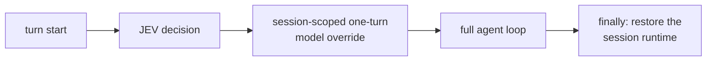

# Auto routing design (not enabled)

This document specifies how automatic switching *would* work. Nothing here is
implemented in this release, and enabling it requires an explicit approval flag that
the code itself checks.

## Insertion point

The shadow plugin uses an observer hook that cannot change a request. Automatic
routing needs a different seam: a **session-scoped, turn-scoped model override**
applied before the first LLM call of a turn and restored afterwards.



Why this shape:

- It is **session-scoped** by construction: the override is stored per session, so two
  concurrent sessions cannot observe each other's route.
- It is **turn-scoped**: the runtime is restored at the end of the turn, including on
  the error path, so no later turn inherits a route it did not ask for.
- It reuses the runtime-resolution path the gateway already uses for operator-driven
  model selection, which means credentials, base URL, capability flags and request
  overrides for the target provider are resolved by existing code rather than
  reimplemented next to a plugin.

Alternatives considered:

| Approach | Verdict |
|---|---|
| Observer hook (`pre_api_request`) | Cannot change the model — correct for shadow, insufficient for auto |
| Request-level middleware (mutate the outgoing call) | Same provider only; cannot switch provider identity |
| Execution-level middleware (wrap the provider call) | Would require re-implementing streaming, tool-call assembly, retry/rotation, error shapes and accounting — rejected as a correctness risk for a "no core change" argument |
| Turn-scoped session override (chosen) | One narrow core seam; all existing provider machinery is preserved |

## Concurrency requirements

Before auto mode may be enabled, the following must hold — and must be shown, not
assumed:

1. A switch is only ever issued for the session's own agent instance; no shared object
   is mutated. (Analysed: the gateway caches one agent per session.)
2. A session's turns cannot overlap. (Analysed: an in-flight marker prevents a second
   message from entering the same turn, and a per-session lease serialises keys that
   map to the same session.)
3. A switch is always restored on every exit path, including exceptions, cancellation
   and interruption.
4. A per-session switch generation token prevents a stale restore from undoing a
   newer turn's switch.
5. No switching from auxiliary calls, sub-agents or background jobs.
6. A breaker disables the router after N consecutive failures.

Item 3 is the residual risk in the current analysis and is exactly why the override is
applied by the turn orchestration layer — which owns the turn's `finally` — rather
than by a hook that does not.

**Outstanding before enablement:** an empirical concurrent test with two sessions
switching simultaneously. Until it exists, the status is "safe by construction,
unproven under load".

## Sticky routing and hysteresis

Switching a provider is not free. The cost has three components:

1. **Prompt cache miss.** A provider caches the conversation prefix. Switching
   providers invalidates the cache on *both* sides — the new provider must reprocess
   the prefix uncached, and the old provider's cache goes cold. In measured
   production usage the cached prefix dominated the per-turn input (cached input
   tokens exceeded fresh input tokens by one to two orders of magnitude), so
   per-turn switching can cost more than the routing saves.
2. **Runtime reconstruction.** A model change rebuilds the provider client and
   re-resolves reasoning/compression configuration for the new model; the session's
   cached agent for the previous route is discarded.
3. **Reasoning-artifact mismatch.** Some providers emit reasoning artifacts that
   cannot be reconstructed or replayed on another provider. A thread carrying such
   artifacts must not be moved mid-flight.

Therefore the router must be *sticky*: it keeps the current route unless a switch is
clearly justified.

Proposed decision rule (informative, not implemented):

```text
switch only if ALL of:
  confidence            >= 0.75            (above the shadow threshold)
  probability margin    >= 0.30
  challenger wins       >= 2 consecutive turns
  cooldown              >= 5 turns or >= 10 minutes since the last switch
  context size          < 20k tokens       (do not move a long thread)
  history               contains no provider-specific reasoning artifacts
  task class changed    (e.g. routine -> coding/debugging/architecture)
otherwise: keep the current route
```

Per-session state needed by the rule: current route, previous route, turns since the
last switch, rolling confidence/margin, context size estimate, provider failure count
and the last decision source. All of it is session-local.

**Not yet measurable.** `context size` in the rule above means the agent's live
conversation context, and the current telemetry does **not** measure it:
`dossier_token_estimate` describes the routing input only

— the sanitised dossier, not the agent's context or the provider's prompt cache. Real
context/cache sizes, and therefore the true switching cost, are runtime signals that a
future auto release has to collect before this rule can be evaluated on real traffic.
Until they are collected, the rule stays a design sketch and auto stays off.

## Observability before autonomy

The same telemetry that shadow mode produces is what a decision rule must be
evaluated on: how often the challenger wins by a large margin, how correlated the
task class is with the JEV choice, how often confidence sits near the threshold, and
how expensive the switches would have been. `would_execute` already records what auto
mode *would* have done, so the rule can be evaluated offline against real turns
before any of them is switched.

## Rollout gates

| Gate | Condition |
|---|---|
| G0 (now) | Shadow only; decisions recorded, execution unchanged |
| G1 | Real-traffic sample large enough to evaluate the rule; distributions published |
| G2 | Explicit approval flag set; breaker, lease and heartbeat verified |
| G3 | Empirical concurrency test passes; kill switch exercised under load |
| G4 | Auto enabled for a bounded window (`auto_until`) with a fresh heartbeat, and sticky routing active |

Failure to satisfy any gate keeps the router in shadow mode.
